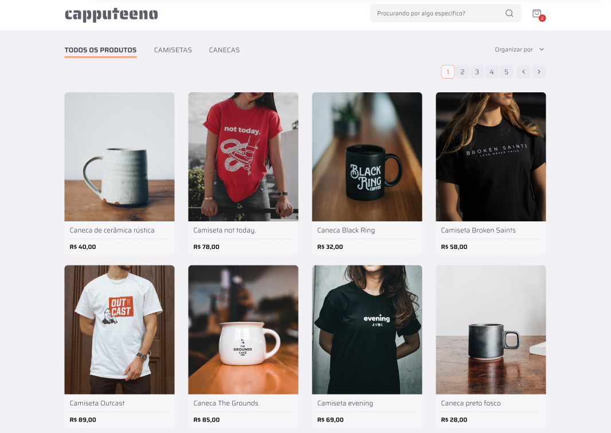

<p align="center">
  
</p>

<h1 align="center"> Desafio Fullstack - Capputeeno </h1>

Nesse repositório contém a implementação de um sistema de E-commerce projetado para venda de produtos digitais. A aplicação possui várias funcionalidades, incluindo busca, filtro, paginação em um catálogo de produtos e gerenciamento do carrinho de compras.

<p align="center">
  
</p>

## 🔧 Rodando localmente

1. Clone o projeto:

```bash
  git clone https://github.com/EduardoNGomes/cursaedu-front
```

2. Entre no diretório do projeto e instale as dependências:

```bash
  npm i
```

3. Crie um arquivo com o nome de .env.local similar ao .env copy, trocando pela porta do seu back-end:

4. Inicie o servidor

```bash
  npm run dev
```

## 📋 Funcionalidades

- O usuário poderá navegar por um catálogo de produtos com paginação;
- O usuário poderá visualizar uma página de descrição do produto;
- O usuário poderá filtrar os produtos por categoria;
- O usuário poderá buscar pelo nome de um produto;
- O usuário poderá adicionar um produto no carrinho;
- O usuário poderá remover um produto do carrinho;
- O usuário poderá finalizar a compra e ter o seu carrinho zerado.

## 🛠️ Tecnologias usadas no back-end:

- [Next.js](https://nextjs.org/) - framework React para desenvolvimento de aplicações web;
- [Tailwind CSS](https://tailwindcss.com/) - framework CSS para estilização rápida e eficiente;

##

Desenvolvido por Eduardo Gomes
